  
  &nbsp;&nbsp;
  

# Hi, I'm Aimen Hamama 👋
### Computer Engineering Student | International Trade & Logistics Specialist

I am a dual-degree student in **Computer Engineering** and **International Trade**. I specialize in bridging the gap between technical software solutions and global supply chain optimization.

- 🎓 **Education:** Engineering Degree at SUPMTI & International Trade at FSJESM.
- 🏢 **Focus:** information system (SI), Full-stack Development, and Data Analysis.
- 🚀 **Key Projects:** World Cup 2030 Fan Platform & Dar Al-Andalus Reservation System.
- ✉️ **Contact:** aimenhamama201@gmail.com
- 🔗 **LinkedIn:** [Aimen Hamama](https://www.linkedin.com/in/aimen-hamama-816b3b2b3)

---

## 🛠️ Technologies & Tools

  

---

## 📊 GitHub Activities

  <table align="center" border="0">
    <tr>
      <td align="center">
         <picture>
          <source media="(prefers-color-scheme: dark)" srcset="https://github-readme-stats-eight-theta.vercel.app/api?username=aimenhamama&show_icons=true&theme=radical&hide_border=true">
          <source media="(prefers-color-scheme: light)" srcset="https://github-readme-stats-eight-theta.vercel.app/api?username=aimenhamama&show_icons=true&theme=default&hide_border=true">
          
        </picture>
      </td>
      <td align="center">
        <picture>
          <source media="(prefers-color-scheme: dark)" srcset="https://github-readme-streak-stats.herokuapp.com/?user=aimenhamama&theme=tokyonight&hide_border=true">
          <source media="(prefers-color-scheme: light)" srcset="https://github-readme-streak-stats.herokuapp.com/?user=aimenhamama&theme=default&hide_border=true">
          
        </picture>
      </td>
    </tr>
  </table>

---

## 🐍 Contribution Graph

  <picture>
    <source media="(prefers-color-scheme: dark)" srcset="https://raw.githubusercontent.com/aimenhamama/aimenhamama/output/github-contribution-grid-snake-dark.svg">
    <source media="(prefers-color-scheme: light)" srcset="https://raw.githubusercontent.com/aimenhamama/aimenhamama/output/github-contribution-grid-snake.svg">
    
  </picture>

---

## 📊 GitHub Stats & Trophies

  

